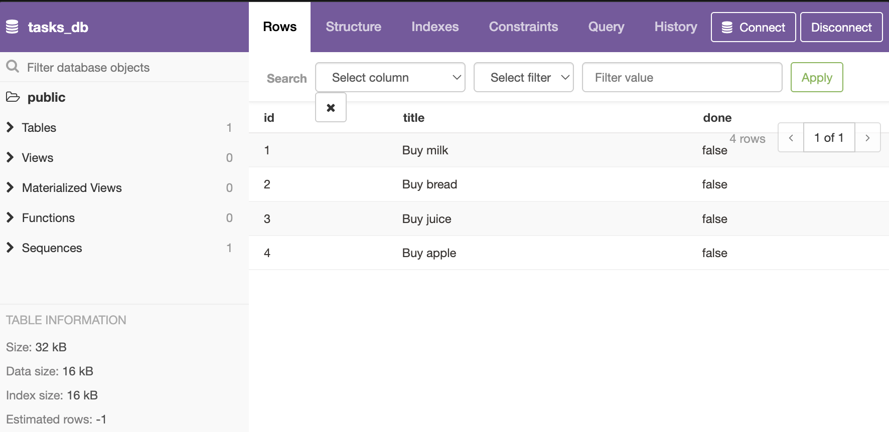

# A2_todo-postgres
A to-do list CRUD API built with Node.js, Express, and PostgreSQL — create, read, update, and delete tasks with persistent storage, parameterized queries, and interactive Swagger UI docs.

## Why Postgres

The assignment's default suggestion was SQLite, but this project uses PostgreSQL instead — same idea (SQL, persistence, parameterized queries), just a client/server database rather than a single file. The tradeoff: Postgres needs a running server and an existing database to connect to (see setup below), in exchange for the same engine used in most real production backends.

## Where the data lives

Tasks are stored in a `tasks` table inside a Postgres database, connected to via the `DATABASE_URL` env var (see `.env.example`). Locally that's `postgresql://localhost:5432/tasks_db`. The `tasks` table and its three seed rows are created automatically on startup ([db.js](db.js)) — but unlike SQLite, the `tasks_db` *database* itself must already exist on your Postgres server before the app can connect (Postgres won't create a missing database for you).

## Running it

```bash
createdb tasks_db        # one-time: create the database (skip if it already exists)
npm install
cp .env.example .env     # adjust DATABASE_URL if your Postgres setup differs
npm start
```

Then `GET http://localhost:3000/tasks` returns the three seeded tasks. Restarting the server does not duplicate them — the seed only runs when the table is empty.

## Database viewer

Screenshot of `tasks_db` open in [pgweb](https://github.com/sosedoff/pgweb) (the Postgres equivalent of DB Browser for SQLite):



## SQL by hand

Queried the database directly with `psql` while the API server was running:

```sql
SELECT * FROM tasks WHERE done = true;
```

Returned the 2 tasks currently marked done, straight from Postgres — hitting `GET /tasks` afterward showed the exact same rows, confirming the API and a direct SQL client are reading the same source of truth with no syncing involved.
